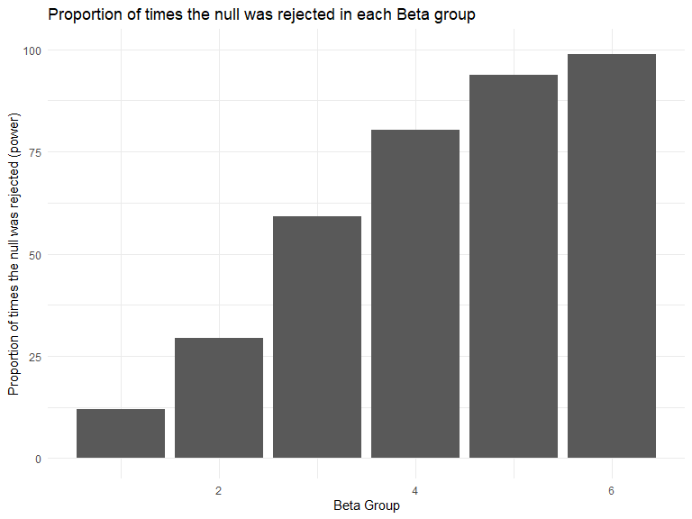
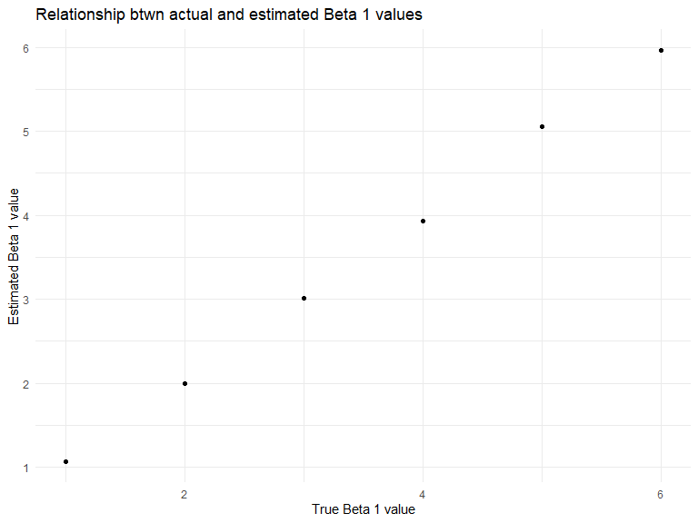
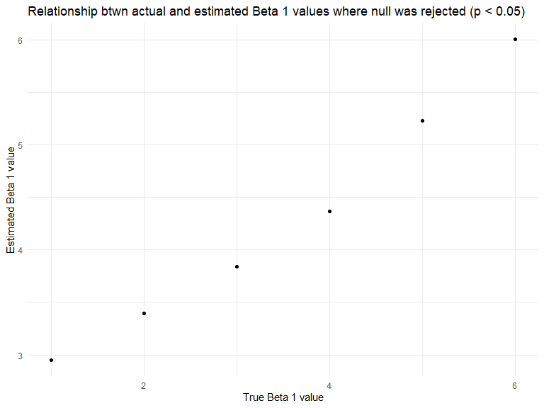

p8105\_hw5\_kmw2189
================
Kylie Wheelock Riley
11/11/2019

## Problem 1

Problem 1 uses the iris dataset from the tidyverse package and contains
some missing values in each column. The purpose of this problem is to
fill in those missing values.

``` r
set.seed(10)

iris_with_missing = iris %>% 
  map_df(~replace(.x, sample(1:150, 20), NA)) %>%
  mutate(Species = as.character(Species)) %>% 
  janitor::clean_names()
```

Instructions: 1) For numeric variables, you should fill in missing
values with the mean of non-missing values 2) For character variables,
you should fill in missing values with “virginica”

``` r
## write a function that takes a vector as an argument. 
replace_iris = function(col_name){
  

  if(is.numeric(col_name))
    {
    new_value = replace_na(col_name, mean(col_name, na.rm = TRUE))
  } 
  
  else if(is.character(col_name))
    {
    new_value = replace_na(col_name, "virginica")
  }
  
  new_value
}

iris_without_missing = map_dfr(iris_with_missing, replace_iris)
```

## Problem 2

Problem 2 contains data from a longitudinal study that included a
control arm and an experimental arm. Data for each participant is
included in a separate file, and file names include the subject ID and
arm.

``` r
##Start with a dataframe containing all file names; the list.files function will help
csv_df = tibble (
  file_name = list.files(path = "./data", full.names = TRUE)
) %>% 

##Iterate over file names and read in data for each subject using purrr::map and saving the result as a new variable in the dataframe
  
  mutate(
    csv_ouput = map(file_name, read_csv)
    ) %>% 
  unnest() %>% 
  
##Tidy the result; manipulate file names to include control arm and subject ID, make sure weekly observations are “tidy”, and do any other tidying that’s necessary
  
  pivot_longer(
          week_1:week_8,
          names_to = "week",
          names_prefix = "week_",
          values_to = "value"
          ) %>%
   separate(file_name, into = c("remove_1", "remove_2", "temp_1"), sep = "/") %>% 
  mutate(
    arm_id = str_replace(temp_1, ".csv", "")
    ) %>% 
  separate(arm_id, into = c("arm", "subject_id"), sep = "_", remove = FALSE ) %>% 
  select(
    c("arm_id", "arm", "subject_id", "week",  "value")
    ) %>% 
  mutate(
    subject_id = as.integer(subject_id),
         arm_id = factor(arm_id),
         arm = factor(arm)
    )  
```

Make a spaghetti plot showing observations on each subject over time.

``` r
csv_df %>% 
  ggplot(aes(x = week, y = value, group = arm_id, color = arm)) +
    geom_line() + 
    labs(
      title = "Observations over time",
      x = "week",
      y = "observation value",
      caption = "Data from a longitudinal study with control arm and experimental arm"
    ) + 
    viridis::scale_color_viridis(
      name = "Arm", 
      discrete = TRUE
    )
```


**Comment on differences between groups:**

Both groups start at approximately the same values. The control group
appears to have values that stay relatively constant over time, while
the experimental group appears to have values that increase over the 8
week period.

## Problem 3

When designing an experiment or analysis, a common question is whether
it is likely that a true effect will be detected – put differently,
whether a false null hypothesis will be rejected. The probability that a
false null hypothesis is rejected is referred to as power, and it
depends on several factors, including: the sample size; the effect size;
and the error variance. In this problem, you will conduct a simulation
to explore power in a simple linear regression.

``` r
##Set design elements for linear regression
sim_regression = function(beta_1_input){
  
  sim_data = tibble(
    x1 = rnorm(30, 0, 1), 
    sigma_squared = 50, 
    beta0 = 2, 
    beta1 = (beta_1_input),
    y = beta0 + beta1 * x1 + rnorm(30, 0, sqrt(sigma_squared))
)
  
  ls_fit = lm(y ~ x1, data = sim_data)
  
  ##for each dataset, save beta1 and the p-value from a test of H:β1=0 using α=0.05. 
  
output = broom::tidy(ls_fit) %>% 
    janitor::clean_names() %>% 
    filter(term == "x1") %>%
    select(estimate, p_value)
}
```

``` r
##Generate 10000 datasets from the model
sim_results = 
  rerun(1000, sim_regression(0)) %>% 
  bind_rows()

sim_results
```

    ## # A tibble: 1,000 x 2
    ##    estimate  p_value
    ##       <dbl>    <dbl>
    ##  1    2.02  0.207   
    ##  2    1.23  0.182   
    ##  3    0.603 0.606   
    ##  4    3.03  0.000149
    ##  5   -1.19  0.471   
    ##  6   -1.49  0.219   
    ##  7   -1.97  0.192   
    ##  8    0.331 0.769   
    ##  9    0.576 0.670   
    ## 10    2.40  0.134   
    ## # ... with 990 more rows

``` r
##Repeat the above for β1={1,2,3,4,5,6}
sim_results = 
  tibble(beta_1 = c(1, 2, 3, 4, 5, 6)) %>% 
  mutate(
    output_lists = map(.x = beta_1, ~rerun(1000, sim_regression(beta_1_input = .x))),
    estimate_dfs = map(output_lists, bind_rows)) %>% 
  select(-output_lists) %>% 
  unnest(estimate_dfs)

sim_results
```

    ## # A tibble: 6,000 x 3
    ##    beta_1 estimate p_value
    ##     <dbl>    <dbl>   <dbl>
    ##  1      1  -1.51    0.304 
    ##  2      1   1.66    0.265 
    ##  3      1  -0.700   0.661 
    ##  4      1   0.0700  0.957 
    ##  5      1   1.83    0.179 
    ##  6      1   1.89    0.0873
    ##  7      1  -1.98    0.291 
    ##  8      1   0.131   0.948 
    ##  9      1   1.20    0.504 
    ## 10      1   2.59    0.0785
    ## # ... with 5,990 more rows

Make a plot showing the proportion of times the null was rejected (the
power of the test) on the y axis and the true value of Beta 2 on the x
axis.

``` r
sim_results %>% 
  group_by(beta_1) %>% 
  mutate(
    sig = p_value < 0.05
  ) %>% 
  summarize(prop_sig = 100*mean(sig)) %>% 
  ggplot(aes(x = beta_1, y = prop_sig)) + 
  geom_bar(stat = "identity") +
  labs(
    title = "Proportion of times the null was rejected in each Beta group", 
    x = "Beta Group",
    y = "Proportion of times the null was rejected (power)"
  ) +
  scale_y_continuous(lim = c(0, 100))
```



**Describe the association between effect size and power:**

As the effect size increases, power increases.

Make a plot showing the average estimate of Beta 1 on the y axis and the
true value of Beta 1 on the x axis.

``` r
sim_results %>% 
  group_by(beta_1) %>% 
  mutate(
    avg_est = mean(estimate) 
    ) %>% 
  ggplot(aes(x = beta_1, y = avg_est)) + 
  geom_point(alpha = 1) +
  labs(
    title = "Relationship btwn actual and estimated Beta 1 values", 
    x = "True Beta 1 value",
    y = "Estimated Beta 1 value"
  )
```



Make a second plot (or overlay on the first) the average estimate of β^1
only in samples for which the null was rejected on the y axis and the
true value of β1 on the x axis.

``` r
sim_results %>% 
  filter(p_value < 0.05) %>% 
  group_by(beta_1) %>% 
  mutate(
    avg_est = mean(estimate) 
    ) %>% 
  ggplot(aes(x = beta_1, y = avg_est)) + 
  geom_point(alpha = 1) +
  labs(
    title = "Relationship btwn actual and estimated Beta 1 values where null was rejected (p < 0.05)", 
    x = "True Beta 1 value",
    y = "Estimated Beta 1 value"
  )
```



**Is the sample average of Beta 1 across tests for which the null is
rejected approximately equal to the true value of Beta 1? Why or why
not?**

The sample average when the null hypothesis was rejected was not
approximately equal to the true value, the mean of all of the estimates
was closer to the true value. I believe this is due to the smaller
sample size of estimates when the null was rejected.
